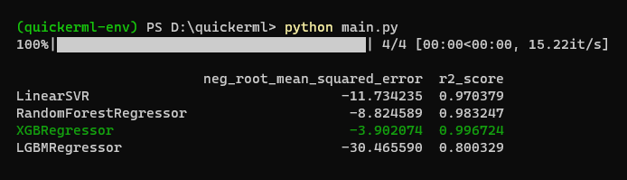

# quickerml
>Machine learning module intended to be your first shot swiss knife.

If you work on Data Science or Artificial Intelligence projects you probably have had to repeat over and over again the same crucial first steps on your project in order to find what's the best model option for your data.  
There is the idea that gave birth to `quickerml`: Automatize those repetitive initial tests to find the best starting model for your project.

### Installation
```
pip install quickerml
```

### Get started
```py
from quickerml import Finder

finder = Finder(
    problem_type='regression', 
    models=[
        LinearSVR(), 
        RandomForestRegressor(), 
        XGBRegressor(), 
        LGBMRegressor()
    ]
)

best = finder.find(X, y)
```

<p align="center">
  
</p>